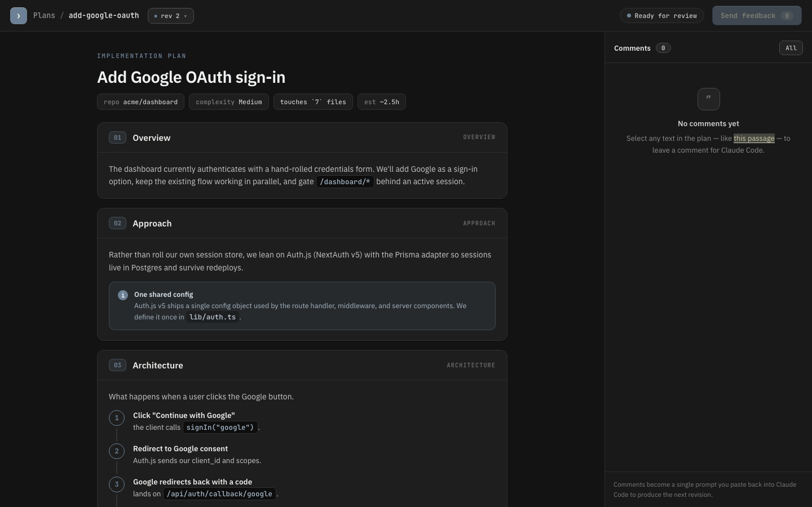

# Visual Planner

A [Claude Code](https://docs.claude.com/en/docs/claude-code) plugin for **browser-reviewable, iterable planning**.

Instead of a plan scrolling past in your terminal, Claude Code writes it to a local
Markdown file and you review it in a polished browser UI: highlight any passage, leave a
comment, and click **Send feedback** to get a ready-to-paste prompt that produces the next
revision. Every revision is saved locally, and you can switch between them and see the diff.



---

## The loop

1. **Generate** — `/visual-planner:plan <feature>` → Claude researches your codebase and
   writes `plans/<slug>/rev-001.md` plus a manifest.
2. **Review** — `/visual-planner:plan-view <slug>` → opens the plan in your browser.
   Highlight text → **+ Comment** → write what you want changed.
3. **Send back** — click **Send feedback**, copy the generated prompt, and paste it into
   Claude Code (or run `/visual-planner:plan-revise <slug>`).
4. **Iterate** — Claude writes `rev-002.md`. The viewer picks it up live; switch to it and
   hit **Compare with previous** to see exactly what changed. Repeat until it's right.

---

## Prerequisites

- **Claude Code** recent enough to have the `/plugin` command (`/help` should list it).
- **Node.js ≥ 18** on your `PATH`. The viewer server uses only Node built-ins — there is
  **no `npm install`** and **no dependencies** to pull.
- A modern **browser** (Chrome, Edge, Safari, or Firefox). The in-page comment highlighter
  uses the [CSS Custom Highlight API](https://developer.mozilla.org/docs/Web/API/CSS_Custom_Highlight_API).

---

## Install

### Option A — Marketplace (recommended)

```text
/plugin marketplace add jackkfan0305/visual-planner
/plugin install visual-planner@visual-planner
/reload-plugins
```

Or open the `/plugin` UI, add the marketplace, and install from there.

### Option B — Local / development

Clone the repo and point Claude Code at it:

```bash
git clone https://github.com/jackkfan0305/visual-planner
claude --plugin-dir /path/to/visual-planner
```

Verify it loaded with `/help` — you should see the three `visual-planner:*` commands.

---

## Usage

All commands are namespaced under `visual-planner:`.

| Command | What it does |
| --- | --- |
| `/visual-planner:plan <feature description>` | Researches your codebase and writes revision 1 of a plan to `plans/<slug>/rev-001.md`. |
| `/visual-planner:plan-view [slug]` | Starts the local viewer and opens the plan in your browser. Omit the slug to get a picker. |
| `/visual-planner:plan-revise [slug]` | Applies the comments saved from the viewer and writes the next revision. (Pasting the **Send feedback** prompt does the same thing.) |

Example:

```text
/visual-planner:plan add rate limiting to the public API
/visual-planner:plan-view add-rate-limiting
# ...review, comment, Send feedback, paste back...
```

### Where plans are stored

Plans live in a `plans/` folder at the root of the **current project**, one folder per plan:

```text
plans/
└── add-rate-limiting/
    ├── plan.json              # manifest: title, branch, revisions, latest
    ├── rev-001.md             # revision 1 (plain Markdown — reference it with @plans/...)
    ├── rev-002.md             # revision 2
    └── rev-002.comments.json  # comments captured in the viewer (optional sidecar)
```

The `rev-*.md` files are ordinary Markdown, so they're useful on their own — commit them
to version control to keep a record of how a plan evolved, or add `plans/` to `.gitignore`
if you'd rather keep them local. Reference any revision in chat with `@plans/<slug>/rev-002.md`.

---

## How a plan is structured

Each `## ` heading becomes a card in the viewer. The renderer understands a few optional
conventions (full details in [`templates/plan-template.md`](./templates/plan-template.md)):

- `> [!NOTE]` / `> [!WARN]` blockquotes → info / warning callouts
- a code fence with a path in the info string (```` ```ts lib/auth.ts ````) → code block with a filename header
- a ```` ```tree ```` fence with `+ new` / `~ note` / `· unchanged` markers → annotated file tree
- a numbered list under an "Architecture" section → step-flow diagram
- Markdown tables (mark the chosen row with `(chosen)`) → styled comparison table with a CHOSEN chip
- `- [ ]` task lists with `~30m`-style tokens → checklist with time chips

---

## Configuration

The viewer server (`server/server.js`, launched by the `bin/visual-planner` wrapper) accepts:

| Flag | Default | Meaning |
| --- | --- | --- |
| `--plan <slug>` | — | Plan to open on launch. |
| `--port <n>` | `4517` | Listen port (auto-increments if busy). |
| `--root <dir>` | current dir | Project root that contains `plans/`. |
| `--no-open` | off | Don't auto-open the browser. |

---

## Troubleshooting

- **Commands don't appear** — run `/reload-plugins`, and remember they're namespaced
  (`/visual-planner:plan`, not `/plan`). Update Claude Code if `/plugin` is missing.
- **Browser didn't open** — copy the `http://localhost:<port>/...` URL from the command
  output and open it manually.
- **Port already in use** — the server auto-increments; check the printed URL for the
  actual port, or pass `--port`.
- **Highlights/comments not showing** — use a browser that supports the CSS Custom
  Highlight API (recent Chrome, Edge, Safari, or Firefox).
- **"node: command not found"** — install Node.js ≥ 18 and ensure it's on your `PATH`.

---

## Development

The plugin is written in **TypeScript** (`strict` mode) under `src/`, and compiled to the
JavaScript the runtime uses:

- `src/server/*.ts` → `server/*.js` (CommonJS, run by Node)
- `src/viewer/*.ts` → `viewer/js/*.js` (ES modules, loaded by the browser)

The compiled output is committed so the plugin works on install with **no build step** for
end users. TypeScript is a dev-only dependency — the runtime stays zero-dependency.

```bash
npm install        # dev-only deps (typescript, @types/node, marked types)
npm run build      # compile src/ -> server/ and viewer/js/
npm run typecheck  # strict type-check with no emit
```

The viewer is checked against `marked`'s official token types via a type-only import
(erased at compile time), and the `marked` runtime is still loaded as a global `<script>`,
so no bundler or runtime dependency is introduced. `viewer/vendor/marked.min.js` is the only
third-party file — everything else under `server/` and `viewer/js/` is generated from `src/`.

When you change anything under `src/`, run `npm run build` and commit both the `.ts` source
and the regenerated `.js` output.

## License

MIT — see [LICENSE](./LICENSE).
